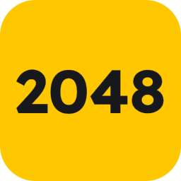
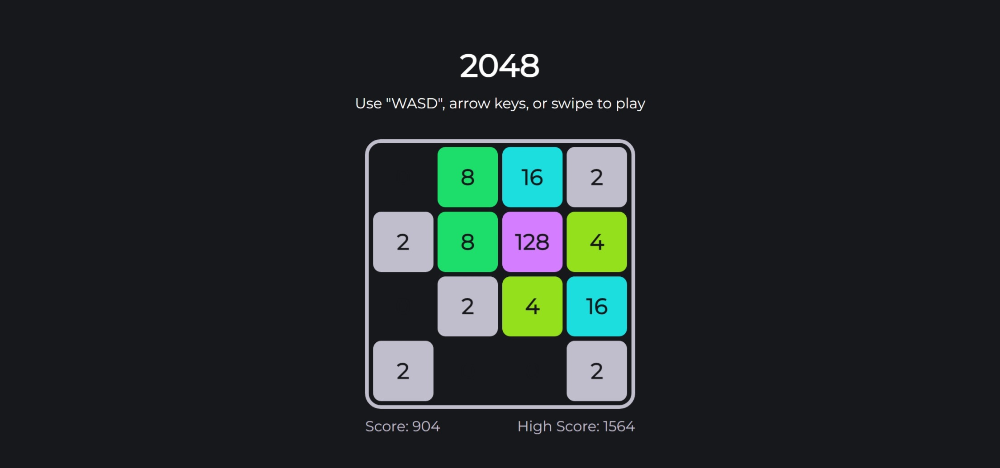

 

<h1>
  2048
</h1>

  Add up tiles to 2048!

## How to play
Move the blocks. Blocks with the same number add up and merge into one when they touch. Add them up to reach 2048!  

You'll get two blocks with number "2" in random places on the board at the beginning. Every time you make a move, a new block with number "2" will appear in random spare space on the board.  

If the blocks filled up the board and you can't merge any of them, you lose.  

### Controls
- Use "WASD" or arrow keys on desktop devices.
- Swipe to play on touch-based devices.

### Goal
Get a block that reaches 2048 to win.  

## Screenshots
  

## Technology
### Stacks
- HTML
- CSS
- JavaScript

### Details
- `High Score` is stored in local storage

[![BACK TO TOP][back-to-top-button]](#readme-top)

[back-to-top-button]: https://img.shields.io/badge/BACK_TO_TOP-151515?style=flat-square