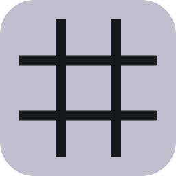
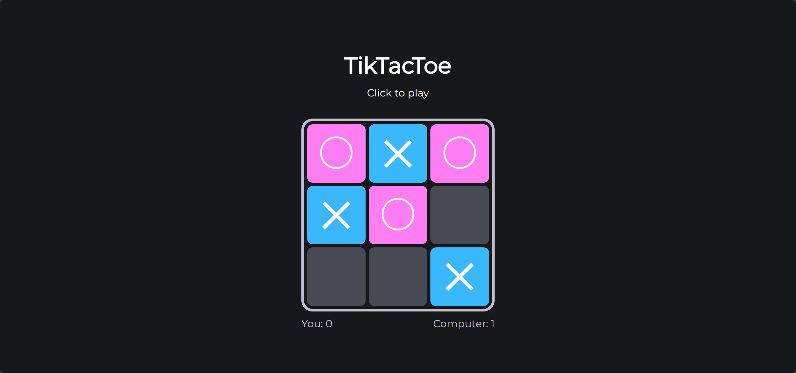

 

<h1>
  TicTacToe
</h1>
  A classic game of Xs and Os.

  

## How to play
Take turns placing your mark (X or O). The first player to align three marks in a row, column, or diagonal wins!  

If the board is filled and no player has aligned three marks, the game ends in a draw.  

You will play as `X`, and the computer will play as `O`.  

### Controls
- Click on a cell to place your mark.

### Goal
Align three of your marks in a row, column, or diagonal to win.  

## Screenshots
  

## Technology
### Stacks
- HTML
- CSS
- JavaScript

### Algorithm
- Using **Minimax algorithm** for computer moves, but with a 10% chance to make a false move to make the player have a chance to win.

### Details
- `Your Score`, `Computer Score` is stored in local storage

### Contributors
- [Katorly](https://github.com/katorly)

[![BACK TO TOP][back-to-top-button]](#readme-top)

[back-to-top-button]: https://img.shields.io/badge/BACK_TO_TOP-151515?style=flat-square